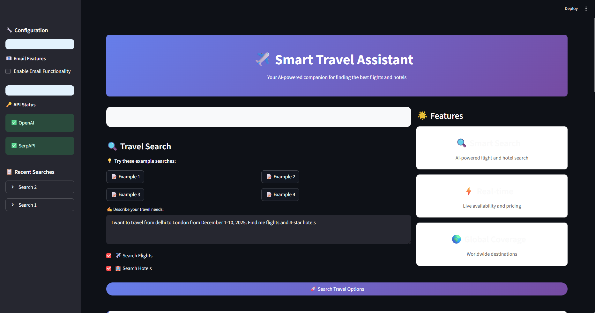
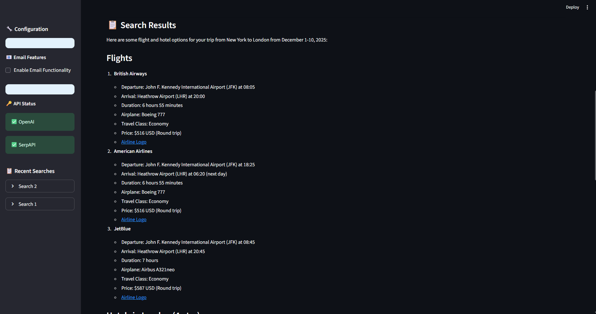
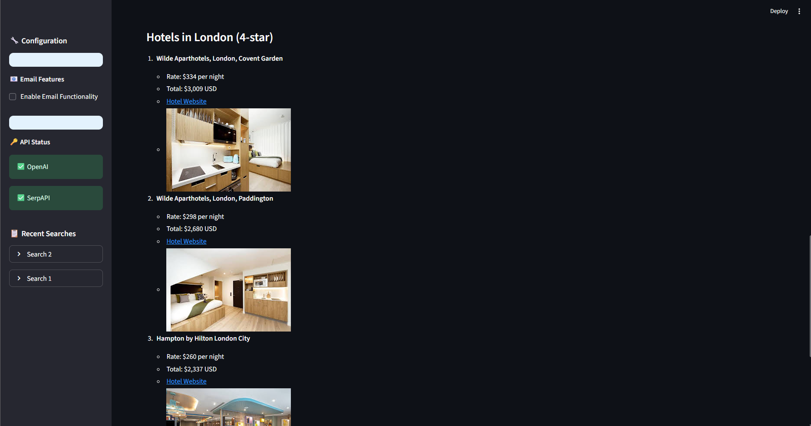

# ✈️ Smart Travel Assistant

A powerful AI-driven multi-agent system that helps you find the best flights and hotels using natural language queries. Built with LangChain, LangGraph, and Streamlit.



## 🎥 Demo

Watch the system in action:

https://github.com/Priteshverma123/Smart-Travel-Agent-using-Langgraph/blob/main/images/demo.mp4

*Or view the demo video in the `/images` folder*

## 🖼️ Screenshots

<div align="center">
  
</div>

<div align="center">
  
</div>

<div align="center">
  
</div>

## 🌟 Features

- **🤖 AI-Powered Search**: Natural language processing for travel queries
- **✈️ Flight Search**: Real-time flight search using Google Flights API
- **🏨 Hotel Search**: Comprehensive hotel search with ratings and amenities
- **📧 Email Integration**: Optional email functionality with multiple providers
- **🎨 Modern UI**: Beautiful and responsive Streamlit interface
- **🔍 Smart Parsing**: Automatically extracts dates, locations, and preferences
- **💰 Price Comparison**: Shows prices, ratings, and booking links
- **📱 Responsive Design**: Works on desktop and mobile devices

## 🏗️ Architecture

The system uses a multi-agent architecture built with LangGraph:

```
User Query → Tools LLM → Flight/Hotel APIs → Format Response → [Optional Email Agent] → Results
```

### Agents:
1. **Tools Agent**: Processes natural language and calls appropriate tools
2. **Flight Finder**: Searches flights using SerpAPI Google Flights
3. **Hotel Finder**: Searches hotels using SerpAPI Google Hotels  
4. **Email Agent** (Optional): Formats and sends results via email

## 📋 Requirements

- Python 3.8+
- OpenAI API key
- SerpAPI key
- Optional: Email service configuration

## 🚀 Quick Start

### 1. Clone the Repository
```bash
git clone <repository-url>
cd smart-travel-assistant
```

### 2. Install Dependencies
```bash
pip install -r requirements.txt
```

### 3. Environment Setup
Create a `.env` file in the root directory:

```env
# Required APIs
OPENAI_API_KEY=your_openai_api_key_here
SERPAPI_API_KEY=your_serpapi_key_here

# Optional Email Settings (choose one method)

# Method 1: SendGrid
SENDGRID_API_KEY=your_sendgrid_api_key
FROM_EMAIL=your-email@domain.com
TO_EMAIL=recipient@domain.com
EMAIL_SUBJECT=Travel Search Results

# Method 2: SMTP (Gmail, Outlook, etc.)
SMTP_SERVER=smtp.gmail.com
SMTP_PORT=587
SMTP_USERNAME=your-email@gmail.com
SMTP_PASSWORD=your-app-password
FROM_EMAIL=your-email@gmail.com
TO_EMAIL=recipient@gmail.com
EMAIL_SUBJECT=Travel Search Results
```

### 4. Run the Application
```bash
streamlit run app.py
```

## 🔑 API Keys Setup

### OpenAI API
1. Go to [OpenAI API](https://platform.openai.com/api-keys)
2. Create an account and get your API key
3. Add to `.env` file

### SerpAPI
1. Go to [SerpAPI](https://serpapi.com/)
2. Sign up for a free account (100 searches/month)
3. Get your API key from dashboard
4. Add to `.env` file

### Email Setup (Optional)

#### Option 1: SendGrid
1. Sign up at [SendGrid](https://sendgrid.com/)
2. Create an API key
3. Verify your sender email
4. Add credentials to `.env`

#### Option 2: SMTP (Gmail)
1. Enable 2FA on your Gmail account
2. Generate an App Password
3. Use `smtp.gmail.com` as server
4. Add credentials to `.env`

#### Option 3: No Email Service
If no email service is configured, results will be saved as HTML files.

## 🎯 Usage Examples

### Basic Flight Search
```
Find flights from New York to Paris from December 15-22, 2024
```

### Hotel Search
```
Find 4-star hotels in Tokyo for 2 adults, January 10-15, 2025
```

### Combined Search
```
I want to travel to London from San Francisco, March 1-8, 2025. 
Find me round-trip flights for 2 adults and luxury hotels near the city center.
```

### Advanced Search
```
Looking for business class flights from Miami to Rome for 2 adults 
and 1 child, departing February 14, returning February 21, 2025. 
Also need 5-star hotels with spa facilities.
```

## 📁 Project Structure

```
smart-travel-assistant/
├── app/
│   ├── tools/
│   │   ├── flight_finder.py    # Flight search tool
│   │   └── hotel_finder.py     # Hotel search tool
│   └── __init__.py
├── images/                     # Demo assets
│   ├── demo-video.mp4         # Application demo video
│   ├── demo-screenshot.png    # Main screenshot
│   ├── main-interface.png     # Interface overview
│   ├── search-results.png     # Results display
│   ├── email-feature.png      # Email functionality
│   ├── mobile-view.png        # Mobile responsiveness
│   └── architecture-diagram.png # System architecture
├── agent.py                    # Main agent logic
├── app.py                      # Streamlit UI
├── main.py                     # CLI interface (optional)
├── requirements.txt            # Python dependencies
├── .env.example               # Environment template
└── README.md                  # This file
```

## 🛠️ Configuration Options

### Agent Configuration
```python
# Enable/disable email functionality
agent = TravelAgent(enable_email=True)

# Search with email
result = agent.search_travel(
    query="Find flights to Paris",
    send_email=True,
    recipient_email="user@example.com"
)
```

### Search Parameters
The system automatically extracts:
- **Locations**: Departure and destination cities
- **Dates**: Travel dates in various formats
- **Passengers**: Adults, children, infants
- **Preferences**: Hotel class, flight class, amenities

## 🔧 Customization

### Adding New Tools
1. Create a new tool in `app/tools/`
2. Follow the LangChain tool format
3. Add to the TOOLS list in `agent.py`

### Modifying Email Templates
Edit the `EMAILS_SYSTEM_PROMPT` in `agent.py` to customize email formatting.

### UI Customization
Modify the CSS in `app.py` to change the appearance.

## 📸 Additional Screenshots

For more screenshots and visual examples, check the `/images` folder which contains:
- `demo-video.mp4` - Complete walkthrough of the application
- `main-interface.png` - Clean, professional UI
- `search-results.png` - Detailed flight and hotel results

## 🐛 Troubleshooting

### Common Issues

**1. API Key Errors**
```
Error: OpenAI API key not found
```
- Solution: Check your `.env` file and ensure API keys are correct

**2. Search Results Empty**
```
No flights/hotels found
```
- Solution: Try different date formats or locations
- Check SerpAPI quota and key validity

**3. Email Not Sending**
```
Email failed to send
```
- Solution: Verify email configuration in `.env`
- Check SMTP settings or SendGrid API key
